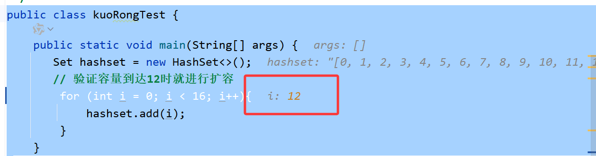
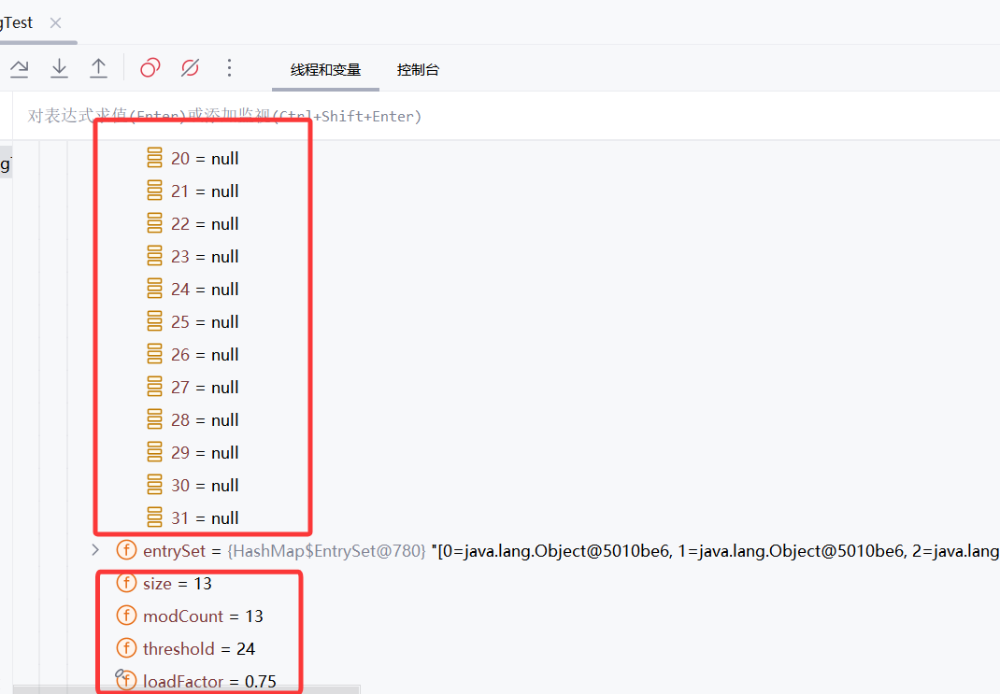
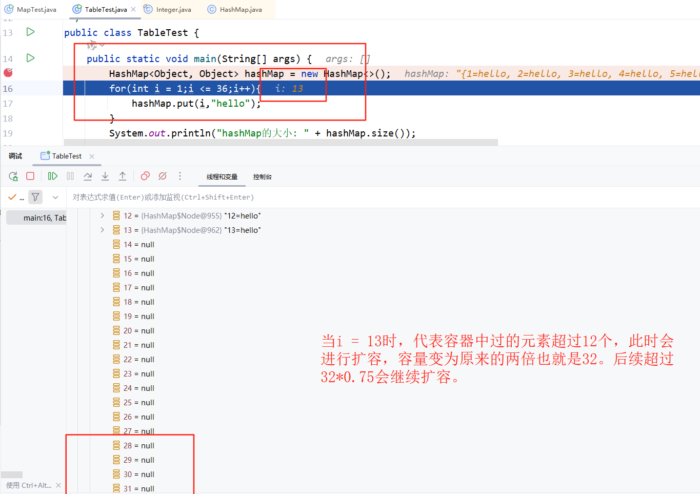
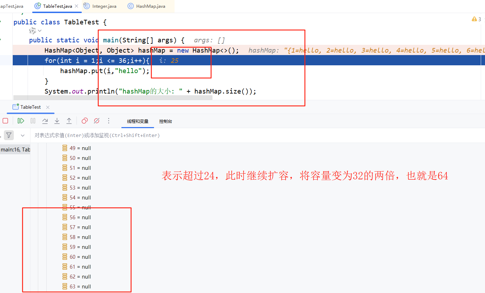
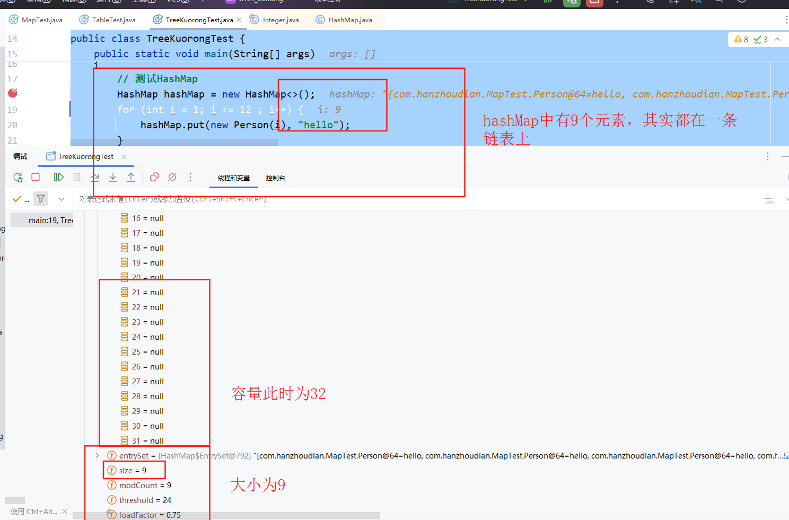
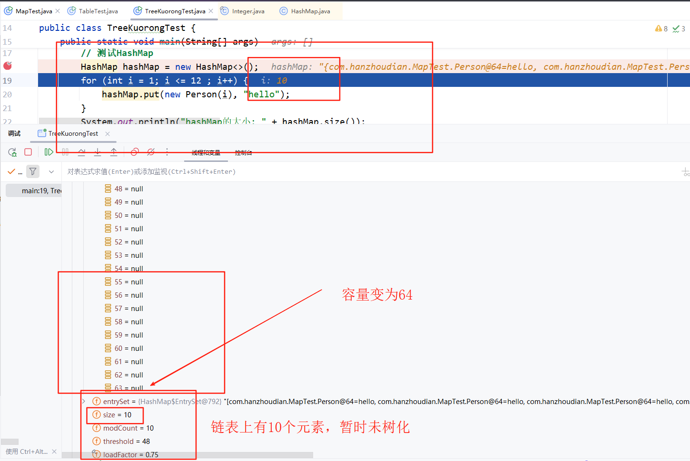
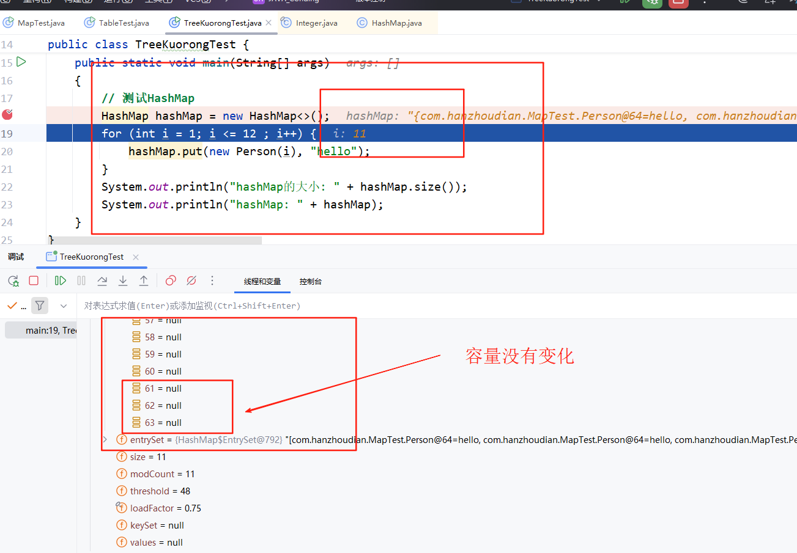
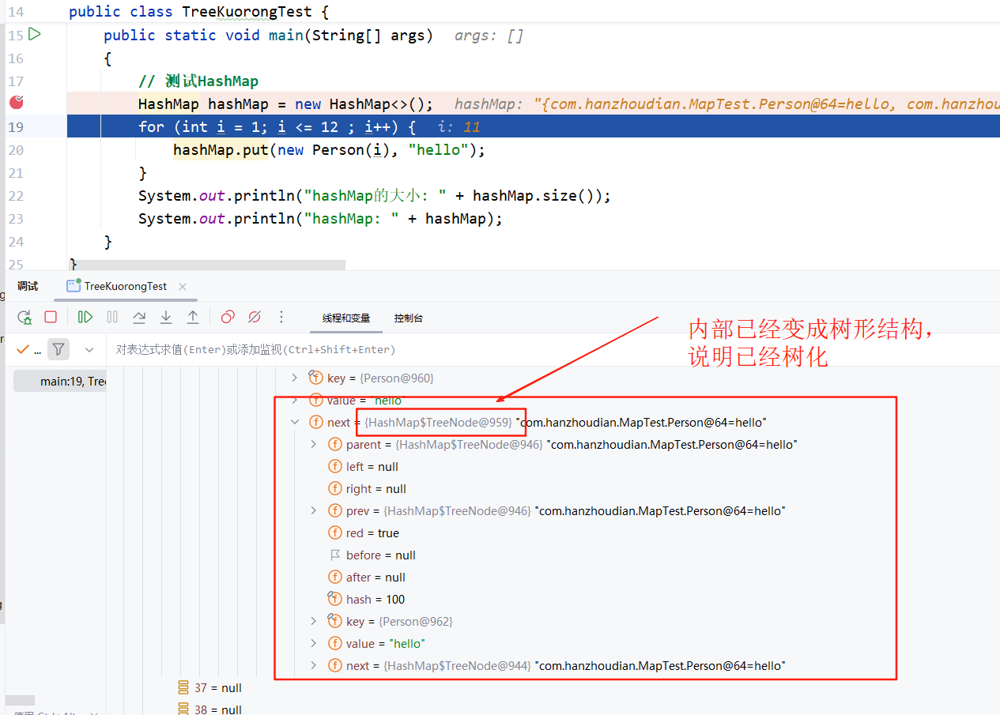

# Java常见Set的使用

## 一：HashSet（是Table + List（或者红黑树）的结构）

1: 定义：HashSet是一个无序的集合，它不保证集合内元素的顺序，并且不允许有重复元素。
2：常见的成员函数
3: 插入时会判断：hashCode() 是否相同；若相同，再通过 equals() 判断两个对象是否“相等”。对于自定义的数据类型，需要重写这两个函数，不然或出现new出来的对象重复出现的问题。

- add：添加元素（增）
  
```JAVA
/*
*   不区分set中对象的类型，所以可以添加任何类型的元素
*   HashSet set = new HashSet<>();
*   或者 HashSet<String> set = new HashSet<>();
*   HashSet<Integer> set = new HashSet<>();
*/
    Set set = new HashSet<>();
    boolean p1 = set.add("hello");
    System.out.println("添加结果: " + p1); // 添加结果: true
    boolean p2 = set.add("world");
    System.out.println("添加结果: " + p2); // 添加结果: true
    boolean p3 = set.add("hello");
    System.out.println("添加结果: " + p3); // 添加添加结果: false，表示Set集合是不允许添加相同的元素的
    System.out.println("HashSet: "+set);  // HashSet: [world, hello]
```

- remove：删除元素（删）
  
```Java
        Set set = new HashSet<>();
        boolean p1 = set.add("hello");
        System.out.println("添加结果: " + p1);
        boolean p2 = set.add("world");
        System.out.println("添加结果: " + p2);
        boolean p3 = set.add("hello");
        System.out.println("添加结果: " + p3);
        System.out.println("HashSet: "+set); // HashSet: [world, hello]
        // 删除指定对象
        boolean temp = set.remove("world");
        System.out.println("HashSet: "+set); // HashSet: [hello]，表示删除了world这个对象
```

- contains：判断元素是否存在（查）
  
```Java
        Set set = new HashSet<>();
        boolean p1 = set.add("hello");
        System.out.println("添加结果: " + p1);
        boolean p2 = set.add("world");
        System.out.println("添加结果: " + p2);
        boolean p3 = set.add("hello");
        System.out.println("添加结果: " + p3);
        System.out.println("HashSet: "+set);
        // 删除指定对象
        boolean temp = set.remove("world");
        System.out.println("HashSet: "+set);
        // p判断元素是否存在
        boolean p = set.contains("hello");
        System.out.println("是否存在: "+p); // 返回true表示存在，false表示不存在
```

- size：获取元素个数
  
```Java
    Set set1 = new HashSet<>();
    set1.add("nihao");
    int size = set1.size();
    System.out.println("size = "+size); // 输出为1
```

- isEmpty：判断集合是否为空
  
```Java
    Set set1 = new HashSet<>();
    set1.add("nihao");
    int size = set1.size();
    System.out.println("size = "+size);
    boolean p4 = set1.isEmpty();
    System.out.println("set1是否为空:"+p4);
```

4: 扩容机制分析

- HashSet底层使用的是HashMap，而HashMap的扩容机制与负载因子LoadFactor和table有关，另外负载因子的大小为0.75，而table的初始值被设置为DEFAULT_INITIAL_CAPACITY，并且该值的大小为16，也就是说一开始创建一个Set的容量为16。下面是Idea的验证。
  
``` Java
// add函数再进行插入操作的时候，会调用到HashMap的putVal函数，然后来执行扩容的操作。
final V putVal(int hash, K key, V value, boolean onlyIfAbsent,
                   boolean evict) {
        // 
        Node<K,V>[] tab; Node<K,V> p; int n, i;
        // 如果初始table为null或者table的容量为0，则进行扩容操作
        // 两种情形进入当前的语句
        // 1：初始化时table此时为null，
        // 2：
        if ((tab = table) == null || (n = tab.length) == 0)
            // 1：进入resize函数进行扩容，这个操作以后，初始化的Set的容量就会变成16，并且有个threshold = 12，这个值等于LOAD_FACTOR * DEFAULT_INITIAL_CAPACITY，只要集合中有12个元素，就会进行扩容操作。将容量扩大为原来的两倍也就是32.
            // 2：为什么到原容量的0.75就进行扩容？因为当Set中的元素容量为12时，如果后续有大量的插入操作，很容易把Set填满，所以只是提前预判的操作；个人感觉是因为效率的问题进行考虑的。
            n = (tab = resize()).length;
        // （1）现在容器已经扩容到16了，开始进行哈希操作，看元素应该插入table（下标从0-15）的哪一个位置，进而将该Node插入到对应的位置
        // 需要注意这是没有发生哈希冲突的时候
        //  （2）判断p是否为空，如果p为空，代表该位置没存放元素，直接插入该元素即可。格式为（key,value）
        if ((p = tab[i = (n - 1) & hash]) == null)
            tab[i] = newNode(hash, key, value, null);
        // 一旦p不为空，代表该位置有元素，需要进行判断（也就是发生哈希冲突，则需要将冲突的Node插入到链表中）
        else {
            // 创建辅助变量，需要使用就创建
            Node<K,V> e; K k;
            //  p = tab[i = (n - 1) & hash]，也就是说p指向的是发生冲突的第一个元素（桶table上的元素）
            // （1）准备加入的对象hash值和key值都和p指向的元素hash值和key值都相同
            // （2）准备加入的对象hash值和p相同并且使用equals方法比较key值相同（针对程序员自己写的equals方法实现）
            //  最重要的就是判断key值是否相同，满足这两个条件就行
            /*
                    | 条件                 | 描述             |
                    | ------------------ | -------------- |
                    | `hashCode()` 相同    | 分到同一个桶         |
                    | `equals()` 返回 true | 是“逻辑上”的同一个 key |
            */
            // 此时不能加入当前对象
            if (p.hash == hash && 
                ((k = p.key) == key || (key != null && key.equals(k))))
                e = p;
            // 执行红黑树数据的插入工作，检查p是不是红黑树，直接使用红黑树的元素插入操作
            else if (p instanceof TreeNode)
                e = ((TreeNode<K,V>)p).putTreeVal(this, tab, hash, key, value);
            // 链表的大小并未到达8，不需要执行树化操作。需要执行的是Node节点的插入工作
            else {
                // 这是一个死循环
                for (int binCount = 0; ; ++binCount) {
                    // 如果当前的节点为空，则将新节点插入到链表的尾部
                    if ((e = p.next) == null) {
                        // 当前元素的指针为空，直接在链表的后面插入一个新结点
                        p.next = newNode(hash, key, value, null);
                        // 链表的元素已经>=8个，此时需要执行别的判断操作
                        // 1：如果链表元素>=8 && table.length >= 64，则将链表转化为红黑树,这样可以提升查询的效率
                        // 2：如果上述条件得不到满足，优先将table进行扩容。
                        // 3：TREEIFY_THRESHOLD默认为8
                        if (binCount >= TREEIFY_THRESHOLD - 1) // -1 for 1st
                            treeifyBin(tab, hash);
                        break;
                    }
                    // 这段代码的意思是新加入的节点一直和table + list上的元素进行比较，一旦发现一样的对象，直接退出
                    // 如果暂未发现一样的元素，一直往下寻找。一旦找到相同的对象，直接break
                    if (e.hash == hash &&
                        ((k = e.key) == key || (key != null && key.equals(k))))
                        break;
                    // 比较一次后，链表的指针继续往下寻找
                    p = e;
                }
            }
            // 这里代表链表中已经存在了key相同的对象，此时需要判断是否需要更新value值
            if (e != null) { // existing mapping for key
                // 保存当前 key 对应的旧值，以便函数最后返回它（符合 Map.put() 语义：返回旧值）。
                V oldValue = e.value;
                /*
                - `onlyIfAbsent` 是 `putIfAbsent()` 专用的一个布尔参数。
                - 如果是普通的 `put()`，这个值是 `false`，意味着无论如何都要覆盖旧值。
                - 如果是 `putIfAbsent()`，这个值是 `true`，表示：**只有当旧值为 null 时才插入新值。**
                */
               // 或者旧值不为空 ，则更新value值
                if (!onlyIfAbsent || oldValue == null)
                    // 更新value值
                    e.value = value;
                afterNodeAccess(e);
                return oldValue;
            }
        }
        // 记录操作的次数
        ++modCount;
        // 检查大小是不是超过阈值，也就是容量的0.75
        if (++size > threshold)
            resize();
        afterNodeInsertion(evict);
        return null;
    }
// ------ resize()函数
final Node<K,V>[] resize() {
        // 将当前table用一个Node []保存起来
        Node<K,V>[] oldTab = table;
        // 判断当前的容量，如果为null，表示一开始初始化，将oldCap设置为0
        // 否则表示已经初始化过了，将oldCap设置为table的长度
        int oldCap = (oldTab == null) ? 0 : oldTab.length;
        int oldThr = threshold;
        int newCap, newThr = 0;
        if (oldCap > 0) {
            // 只要容量超过2^30时，后续就不会再进行扩容
            // 把扩容阈值 threshold 设置成 Integer.MAX_VALUE，表示永远不会再触发扩容
            if (oldCap >= MAXIMUM_CAPACITY) {
                threshold = Integer.MAX_VALUE; //HashMap 允许的最大容量，等于 2^30
                return oldTab;
            }
            // 如果旧容量小于2^30，则进行扩容
            else if ((newCap = oldCap << 1) < MAXIMUM_CAPACITY &&
                     oldCap >= DEFAULT_INITIAL_CAPACITY)//默认初始容量，等于 16
                newThr = oldThr << 1; // double threshold
        }
        else if (oldThr > 0) // initial capacity was placed in threshold
            newCap = oldThr;
        // 初始化的时候table为空，所以oldCap，oldThr 都为0
        // 然后直接跳转到这个分支，将set的容量设置为16，阈值为12
        else {               // zero initial threshold signifies using defaults
            // 大小为16 
            newCap = DEFAULT_INITIAL_CAPACITY;
            // 强转，防止溢出的问题，初始化的时候为0.75*16 = 12.
            newThr = (int)(DEFAULT_LOAD_FACTOR * DEFAULT_INITIAL_CAPACITY);
        }
        if (newThr == 0) {
            float ft = (float)newCap * loadFactor;
            newThr = (newCap < MAXIMUM_CAPACITY && ft < (float)MAXIMUM_CAPACITY ?
                      (int)ft : Integer.MAX_VALUE);
        }
        // 将阈值赋值给threshold，阈值大小为容量的0.75
        threshold = newThr;
        @SuppressWarnings({"rawtypes","unchecked"})
        // 创建一个大小为为newCap的数组，并且赋值给table
        // table从null变为16
        Node<K,V>[] newTab = (Node<K,V>[])new Node[newCap];
        table = newTab;
        // 只要oldTab不是空，就进入这个分支，这不是初始化的操作
        if (oldTab != null) {
            for (int j = 0; j < oldCap; ++j) {
                Node<K,V> e;
                if ((e = oldTab[j]) != null) {
                    oldTab[j] = null;
                    if (e.next == null)
                        newTab[e.hash & (newCap - 1)] = e;
                    else if (e instanceof TreeNode)
                        ((TreeNode<K,V>)e).split(this, newTab, j, oldCap);
                    else { // preserve order
                        Node<K,V> loHead = null, loTail = null;
                        Node<K,V> hiHead = null, hiTail = null;
                        Node<K,V> next;
                        do {
                            next = e.next;
                            if ((e.hash & oldCap) == 0) {
                                if (loTail == null)
                                    loHead = e;
                                else
                                    loTail.next = e;
                                loTail = e;
                            }
                            else {
                                if (hiTail == null)
                                    hiHead = e;
                                else
                                    hiTail.next = e;
                                hiTail = e;
                            }
                        } while ((e = next) != null);
                        if (loTail != null) {
                            loTail.next = null;
                            newTab[j] = loHead;
                        }
                        if (hiTail != null) {
                            hiTail.next = null;
                            newTab[j + oldCap] = hiHead;
                        }
                    }
                }
            }
        }
        return newTab;
    }
```

- 5：扩容验证（扩容是指HashSet中只要有12个对象就进行扩容，不管是Table + List中的节点超过12，还是单独List节点超过12，应该关注size的变化，只要size > 12 就会进行扩容）
  
```Java
public class kuoRongTest {
    public static void main(String[] args) {
       Set hashset = new HashSet<>();
       // 验证容量到达12时就进行扩容
        for (int i = 0; i < 16; i++){
            hashset.add(i);
        }
    }
}


// 可以看到进行了扩容
```

- 6：插入自定义对象检查是否重复（一旦没有重写hashcode和equals方法，就会认为两个对象是不同的）
  
```Java
public class kuoRongTest {
        public static void main(String[] args) {
            Set hashset = new HashSet<>();
            hashset.add(new Person(12));
            hashset.add(new Person(12));
            // hashset = [com.hanzhoudian.SetTest.Person@41629346, com.hanzhoudian.SetTest.Person@3b07d329]
            // 表示两个对象都在hashset中
            System.out.println("hashset = " + hashset);
            System.out.println(hashset.size()); // 输出为2，表示两个对象都插入进hashset中
        }
}
class Person{
    private int age;

    public Person(int age) {
        this.age = age;
    }
}

// 修改版本，重写hashcode和equal函数
public class kuoRongTest {
        public static void main(String[] args) {
            Set hashset = new HashSet<>();
            hashset.add(new Person(12));
            hashset.add(new Person(12));
            // hashset = [com.hanzhoudian.SetTest.Person@2b]
            // 表示只有一个对象都在hashset中
            System.out.println("hashset = " + hashset);
            System.out.println(hashset.size()); // 输出为1，表示一个对象都插入进hashset中
        }
}
// 这个版本用age作为唯一标识，所以hashset中只能有一个对象，因为hashset中不允许有重复的元素
class Person{
    private int age;
    public Person(int age) {
        this.age = age;
    }

    @Override
    public  int hashCode(){
        return Objects.hash(age); // //表示使用age进行hash计算
    }

    @Override
    // 用age作为equal的参数
    public boolean equals(Object o) {
        if (o == null || getClass() != o.getClass()) return false;
        Person person = (Person) o;
        return age == person.age;
    }
}
```

## 二：LinkedHashSet(table + 双向链表)

### 1：与 HashSet的区别

| 特性   | `HashSet`                   | `LinkedHashSet`               |
| ---- | --------------------------- | ----------------------------- |
| 元素顺序 | **不保证顺序**（存进去的顺序和取出来的不一定一样） | **保持插入顺序**（谁先加的，谁先遍历）         |
| 内存占用 | 较少                          | 略高（需要额外维护顺序）                  |
| 底层实现 | 基于 `HashMap<K, Object>`     | 基于 `LinkedHashMap<K, Object>`|
| 遍历结果 | 无序                          | 有序（按插入顺序）                     |
| 性能   | 略快                          | 略慢（要维护双向链表）                   |

### 2：💡 示例对比

```java
Set<String> hashSet = new HashSet<>();
hashSet.add("C");
hashSet.add("A");
hashSet.add("B");
System.out.println(hashSet); // 可能是 [A, C, B]（无序）

Set<String> linkedHashSet = new LinkedHashSet<>();
linkedHashSet.add("C");
linkedHashSet.add("A");
linkedHashSet.add("B");
System.out.println(linkedHashSet); // 输出：[C, A, B]（保持插入顺序）
```

### 三：扩容机制的补充

#### 1：桶扩容机制（table的扩容）

- 桶扩容机制：当桶的容量达到阈值的0.75时，会进行扩容。负载因子DEFAULT_LOAD_FACTOR = 0.75。

- 初始时刻，集合容量为0，插入第一个对象时，容量变成16。后续再加入元素时，只要到达初始容量16的0.75就会扩容。容量变为32，此时集合容量为32，插入元素时，只要达到32的0.75就会扩容。容量变为64，此时集合容量为64，插入元素时，只要达到64的0.75就会扩容。容量变为128，此时集合容量为128，插入元素时，只要达到128的0.75就会扩容。以此类推。
  
- 1：table扩容机制举例

```Java
public class TableTest {
    public static void main(String[] args) {
        HashMap<Object, Object> hashMap = new HashMap<>();
        for(int i = 1;i <= 36;i++){
            hashMap.put(i,"hello");
        }
        System.out.println("hashMap的大小: " + hashMap.size()); // 输出大小为36

    }
}
/**
 * 
 *  1：当i = 1时，hashMap中有一个元素，此时将容量设置为16!
 *  具体如图所示：[alt text](image-2.png)
 * 
 *  2：当i = 13时，hashMap中有12个元素，也就是超过16*0.75，此时将容量设置为32!
 *  具体如图所示：
 * 
 *  3：当i = 25时，hashMap中有24个元素，也就是超过32*0.75，此时将容量设置为64!
 *  具体如图所示：
 * /
```

- 2：table挂载的链表进行扩容测试，并且需要注意树化的时机。树化需要满足table >= 64 && 链表上挂载的元素超过8个。不然优先对table进行扩容。

```Java
public class TreeKuorongTest {
    public static void main(String[] args)
    {
        // 测试HashMap
        HashMap hashMap = new HashMap<>();
        for (int i = 1; i <= 12 ; i++) {
            hashMap.put(new Person(i), "hello");
        }
        System.out.println("hashMap的大小: " + hashMap.size());
        System.out.println("hashMap: " + hashMap);
    }
}

class Person{
    private int num;
    public Person(int num) {
        this.num = num;
    }

    @Override
    // Hash值设置的一样，也就是全部的元素挂载在一条链表上
    public int hashCode() {
        return 100;
    }
}
/**
 * 1：当 i = 9时，其实已经满足链表扩容的机制，但是此时容量为16，还未到达64，则优先对table进行扩容到32。
 * 具体的变化如图所示：
 * 
 * 2：当 i = 10时，继续对table进行扩容，扩容到64.
 * 具体的变化如图所示：
 * 
 * 3：当 i = 11时，不会再对table进行扩容，因为此时已经满足table >= 64 && 链表上的元素大于8个。
 * 具体的变化如图所示，
 * 
 * 
 * 
 * 
 * /
```